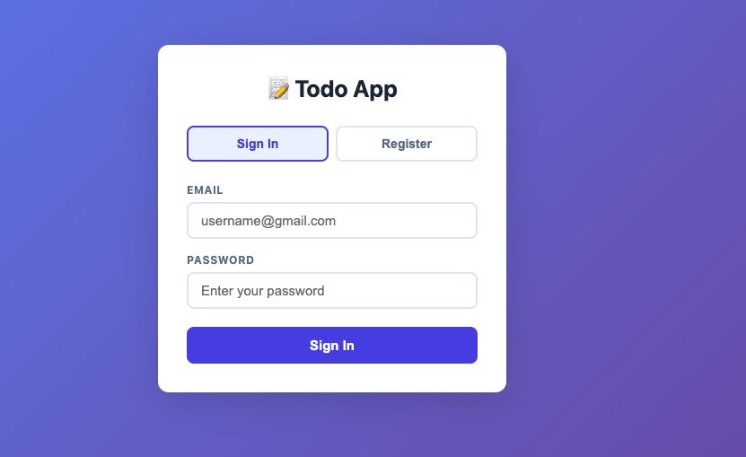

# 📝 Todo App

A simple Todo app with login system built with React.

<p align="center">
  
</p>

---

## ✨ Features

- 🔐 Sign In / Register
- ➕ Add new tasks
- ✅ Mark tasks as done
- 🗑️ Delete tasks

---

## ⚙️ Setup

1. Install dependencies
```bash
   npm install
```

2. Start the app
```bash
   npm start
```

3. Open your browser at **http://localhost:3000**

---

## 🔐 How to Use

1. **Register** a new account
2. **Sign In** with your email and password
3. Start managing your tasks!

---

## 📋 Commands

| Command | What it does |
|--------|--------------|
| `npm start` | Run the app locally |
| `npm test` | Run tests |
| `npm run build` | Build for production |

---

## 🤝 Contributing

Pull requests are welcome!
Please open an issue first for major changes.

## 📄 License

[MIT](https://choosealicense.com/licenses/mit/)